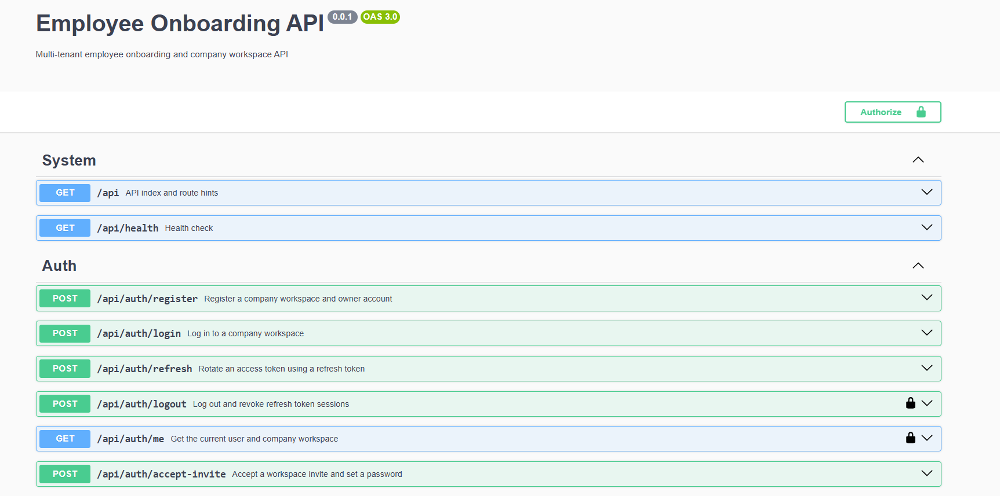
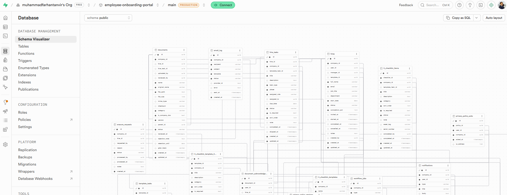
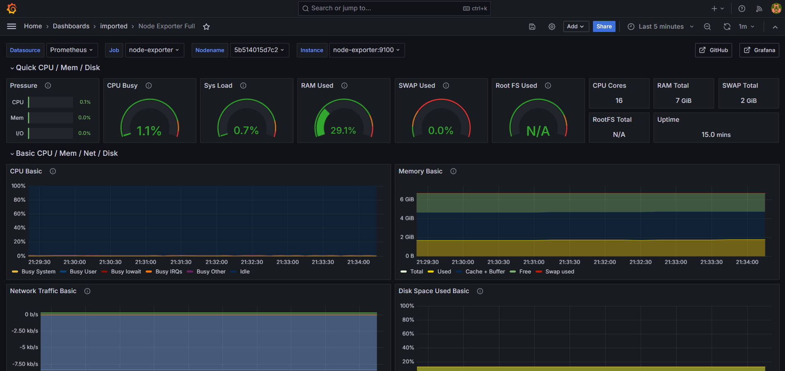
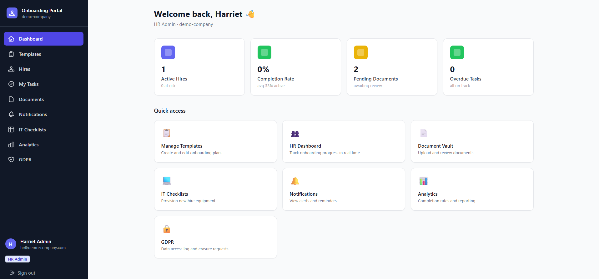
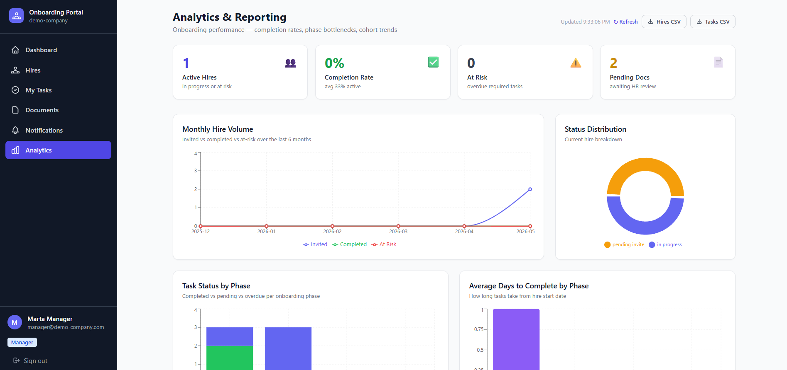

# Employee Onboarding & Document Management Portal

> A production-grade, multi-tenant B2B SaaS platform that digitises the entire employee onboarding journey — from offer acceptance to day-90 check-in — with document management, e-sign acknowledgements, automated workflows, and HR analytics.


---
## Project Snapshots

### API Documentation


### Database Schema


### Monitoring Dashboard


### HR Portal


### Manager Dashboard

---

## Project Overview

The **Employee Onboarding & Document Management Portal** replaces manual, spreadsheet-driven HR onboarding with a structured digital workflow. Companies (tenants) can create role-specific onboarding checklists, assign them to new hires, track completion in real time, manage a secure document vault, and automate reminders for overdue steps.

### The problem it solves

German Mittelstand companies still onboard employees via email threads and printed checklists. A new hire's first week is chaotic — IT doesn't know when to set up accounts, managers don't know what documents are missing, and HR has no visibility. This platform changes that.

### Who uses it

| Role | What they do |
|------|-------------|
| **HR Admin** | Creates onboarding plans, invites new hires, monitors progress |
| **Manager** | Reviews and approves completed onboarding, adds notes |
| **IT Admin** | Gets notified automatically when a new hire is created; completes IT setup checklist |
| **New Hire** | Completes their onboarding tasks, uploads documents, signs acknowledgements |
| **Viewer** | Read-only access to dashboards (e.g. C-suite) |


---


## Tech Stack — Full Breakdown

### Frontend — Next.js 14

| Tool | Version | Purpose |
|------|---------|---------|
| **Next.js** | 14 | App Router, SSR, server actions, streaming UI |
| **TypeScript** | 5 | Full type safety across frontend |
| **TailwindCSS** | 3 | Utility-first styling |
| **shadcn/ui** | latest | Accessible, composable component library |
| **Zustand** | 4 | Lightweight global state (user session, active company) |
| **TanStack Query** | 5 | Server state, caching, background sync, optimistic updates |
| **React Hook Form** | 7 | Form state management |
| **Zod** | 3 | Schema validation shared with backend DTOs |
| **TipTap** | 2 | Rich text editor for checklist descriptions and notes |
| **Recharts** | 2 | Analytics charts (completion rates, hire cohorts) |
| **@dnd-kit** | 6 | Drag-and-drop for checklist task reordering |
| **date-fns** | 3 | Date formatting and deadline calculations |
| **Supabase JS client** | 2 | Realtime subscriptions, auth session management |
| **next-themes** | latest | Light/dark mode |

**Why Next.js App Router?**
Server components reduce JavaScript bundle size for the dashboard. Server actions handle form submissions without extra API round-trips. Streaming renders the analytics dashboard progressively as data loads.

---

### Backend — NestJS

| Tool | Version | Purpose |
|------|---------|---------|
| **NestJS** | 10 | Modular, decorator-based Node.js framework |
| **TypeScript** | 5 | Full type safety |
| **Prisma** | 5 | Type-safe ORM, migrations, Supabase PostgreSQL adapter |
| **Passport.js** | latest | Authentication middleware |
| **passport-jwt** | latest | JWT access token strategy |
| **passport-local** | latest | Email/password login strategy |
| **@nestjs/jwt** | latest | JWT signing and verification |
| **BullMQ** | 4 | Redis-backed job queues for async tasks |
| **@nestjs/bull** | latest | NestJS BullMQ integration |
| **@nestjs/swagger** | 7 | Auto-generated OpenAPI/Swagger documentation |
| **class-validator** | latest | DTO validation decorators |
| **class-transformer** | latest | DTO serialisation / transform |
| **@nestjs/throttler** | 5 | Rate limiting per user/IP |
| **@nestjs/config** | 3 | Environment config with validation |
| **Nodemailer** | 6 | Transactional email (reminders, invites) |
| **pdf-lib** | latest | Server-side PDF generation for invoice/reports |
| **sharp** | latest | Image processing for uploaded profile photos |

**Why NestJS?**
NestJS's module system maps directly to domain boundaries (auth, company, employee, document, checklist). Guards implement RBAC at the controller level. Interceptors handle audit logging. Pipes run Zod/class-validator before any business logic runs.

---

### Database & Backend-as-a-Service — Supabase

| Feature | How it's used |
|---------|--------------|
| **PostgreSQL 15** | Primary relational database for all application data |
| **Row Level Security (RLS)** | Data isolation between tenants at the database level — no company can ever read another company's data |
| **Supabase Auth** | User registration, email confirmation, password reset, Google OAuth |
| **Supabase Realtime** | Live checklist progress updates pushed to HR dashboard without polling |
| **Supabase Storage** | Secure document vault — onboarding documents, signed PDFs, profile photos |
| **Supabase Edge Functions** | Webhook handler for document signing events |
| **pgvector** | (Roadmap) Semantic search across document content |

**Why Supabase over raw PostgreSQL?**
Supabase gives you Auth, Storage, and Realtime out of the box — reducing infrastructure complexity while keeping PostgreSQL as the foundation. RLS policies mean even if there's a bug in the NestJS API, data isolation is enforced at the database layer. This is exactly the kind of defence-in-depth German enterprise clients require.

---

### Infrastructure & DevOps

| Tool | Purpose |
|------|---------|
| **Docker** | Containerise all services (NestJS, Redis, workers) |
| **Docker Compose** | Local development orchestration — one command startup |
| **GitHub Actions** | CI/CD pipeline — lint, test, build, deploy on every push |
| **Railway** | Production hosting for NestJS API and Redis |
| **Vercel** | Next.js frontend hosting with preview deployments |
| **Supabase Cloud** | Managed PostgreSQL + all Supabase features |
| **Redis** | BullMQ job queue backing store |
| **Sentry** | Error tracking and performance monitoring |
| **Resend** | Transactional email delivery (invite emails, reminders) |

---

## Features

### Feature 1 — Multi-tenant Company Workspaces

Each company that signs up gets an isolated workspace. All data is partitioned by `company_id` enforced via Supabase RLS policies. No company can ever read, write, or even discover another company's data.

---

### Feature 2 — Role-based Access Control (RBAC)

Five roles with granular permissions enforced at both the API (NestJS Guards) and database (Supabase RLS) levels.

---

### Feature 3 — Onboarding Plan Templates

HR admins create reusable onboarding plan templates per role (e.g. "Software Engineer", "Sales Rep", "Operations Manager"). Each template contains ordered tasks across configurable phases.

---

### Feature 4 — New Hire Onboarding Journey

When a new hire is invited, an onboarding plan is instantiated from the template. The new hire sees a personalised dashboard showing their progress, upcoming tasks, and deadlines.

---

### Feature 5 — Document Vault & Management

Secure, company-partitioned document storage powered by Supabase Storage with signed URLs for time-limited access.

---

### Feature 6 — Automated Workflow & Reminders

BullMQ job queues handle all async automation — email reminders, IT notifications, deadline escalations, and report generation.

---

### Feature 7 — IT Onboarding Checklist

When HR creates a new hire, the IT admin team receives an automatic task list to provision the new employee's access and equipment.

---

### Feature 8 — Manager Approval Workflow

Managers have a structured review and approval flow that doesn't require HR involvement.

---

### Feature 9 — Real-time Progress Dashboard (HR)

The HR admin dashboard shows the live state of all active onboardings, updated in real time via Supabase Realtime subscriptions.

---

### Feature 10 — Analytics & Reporting

Aggregate HR analytics to understand onboarding performance over time.


---

### Feature 11 — GDPR Compliance Features

Purpose-built for the German market with data protection built in from the start.

---

## User Roles & Permissions

```
Company (Tenant)
│
├── HR Admin
│   ├── Full CRUD on onboarding plans and templates
│   ├── Invite and manage all company members
│   ├── View and approve all documents
│   ├── Access analytics dashboard
│   └── Manage company settings
│
├── Manager
│   ├── View direct reports' onboarding progress
│   ├── Add notes and approve phases
│   ├── Receive 30/90-day review tasks
│   └── View analytics for their team
│
├── IT Admin
│   ├── View IT checklist for new hires
│   ├── Mark IT tasks as complete
│   └── Record equipment/asset details
│
├── New Hire
│   ├── View and complete own onboarding tasks
│   ├── Upload personal documents
│   ├── Sign acknowledgements
│   └── View own progress only
│
└── Viewer
    ├── Read-only dashboard access
    └── View analytics (no PII)
```

---

## System Architecture

```
┌─────────────────────────────────────────────────────────────────┐
│                    User Browser / Mobile                        │
│                      Next.js 14 Frontend                        │
│          App Router · shadcn/ui · Zustand · TanStack Query      │
│          Supabase JS (Auth session + Realtime subscriptions)    │
└────────────────────────┬────────────────────────────────────────┘
                         │ REST (JWT) + Supabase Realtime (WS)
             ┌───────────┴───────────┐
             ▼                       ▼
┌────────────────────┐    ┌──────────────────────────────────────┐
│  NestJS REST API   │    │           Supabase Cloud             │
│  (Docker container)│    │                                      │
│                    │    │  ┌──────────┐  ┌──────────────────┐ │
│  Auth module       │    │  │PostgreSQL│  │  Supabase Auth   │ │
│  Company module    │◄───┤  │+ RLS     │  │  (JWT provider)  │ │
│  Employee module   │    │  └──────────┘  └──────────────────┘ │
│  Checklist module  │    │                                      │
│  Document module   │    │  ┌──────────┐  ┌──────────────────┐ │
│  Analytics module  │    │  │ Realtime │  │  Storage         │ │
│  Notification mod. │    │  │(WebSocket│  │  (Document vault)│ │
└────────────────────┘    │  └──────────┘  └──────────────────┘ │
         │                └──────────────────────────────────────┘
         │
┌────────┴────────────┐
│    Redis (Docker)   │
│    BullMQ Queues    │
│                     │
│  email-queue        │
│  reminder-queue     │
│  report-queue       │
│  notification-queue │
└─────────────────────┘
         │
┌────────┴────────────┐
│  BullMQ Workers     │
│  (Docker container) │
│                     │
│  EmailWorker        │◄── Resend API
│  ReminderWorker     │
│  ReportWorker       │◄── pdf-lib
│  VirusScanWorker    │◄── ClamAV sidecar
└─────────────────────┘
```
## Folder Structure

```
employee-onboarding-portal/
├── apps/
│   ├── web/                              # Next.js 14 frontend
│   │   ├── app/
│   │   │   ├── (auth)/
│   │   │   │   ├── login/page.tsx
│   │   │   │   ├── register/page.tsx
│   │   │   │   ├── accept-invite/page.tsx
│   │   │   │   └── forgot-password/page.tsx
│   │   │   ├── (dashboard)/
│   │   │   │   ├── layout.tsx            # Dashboard shell with sidebar
│   │   │   │   ├── overview/page.tsx     # HR home with KPI cards
│   │   │   │   ├── hires/
│   │   │   │   │   ├── page.tsx          # All hires list
│   │   │   │   │   ├── new/page.tsx      # Create new hire wizard
│   │   │   │   │   └── [hireId]/
│   │   │   │   │       ├── page.tsx      # Hire detail with progress
│   │   │   │   │       ├── tasks/page.tsx
│   │   │   │   │       └── documents/page.tsx
│   │   │   │   ├── templates/
│   │   │   │   │   ├── page.tsx          # Template library
│   │   │   │   │   └── [templateId]/page.tsx
│   │   │   │   ├── documents/page.tsx    # Company document vault
│   │   │   │   ├── analytics/page.tsx    # Analytics dashboard
│   │   │   │   └── settings/page.tsx     # Company settings
│   │   │   └── (hire)/                   # New hire portal (separate layout)
│   │   │       ├── layout.tsx
│   │   │       ├── onboarding/page.tsx   # Hire's own journey view
│   │   │       └── onboarding/[taskId]/page.tsx
│   │   ├── components/
│   │   │   ├── hires/
│   │   │   │   ├── HireCard.tsx
│   │   │   │   ├── HireTable.tsx
│   │   │   │   ├── CreateHireWizard.tsx
│   │   │   │   └── ProgressBar.tsx
│   │   │   ├── tasks/
│   │   │   │   ├── TaskList.tsx
│   │   │   │   ├── TaskItem.tsx
│   │   │   │   ├── TaskDetail.tsx
│   │   │   │   └── PhaseAccordion.tsx
│   │   │   ├── documents/
│   │   │   │   ├── DocumentUpload.tsx
│   │   │   │   ├── DocumentVault.tsx
│   │   │   │   ├── AcknowledgementModal.tsx
│   │   │   │   └── DocumentReviewQueue.tsx
│   │   │   ├── analytics/
│   │   │   │   ├── KpiCard.tsx
│   │   │   │   ├── CompletionChart.tsx
│   │   │   │   └── HireVolumeChart.tsx
│   │   │   ├── notifications/
│   │   │   │   ├── NotificationBell.tsx
│   │   │   │   └── NotificationList.tsx
│   │   │   └── ui/                       # shadcn/ui components
│   │   ├── lib/
│   │   │   ├── api.ts                    # Axios client + interceptors
│   │   │   ├── supabase.ts               # Supabase client (browser)
│   │   │   ├── supabase-server.ts        # Supabase client (server)
│   │   │   └── realtime.ts               # Supabase Realtime hooks
│   │   ├── stores/
│   │   │   ├── auth.store.ts             # Zustand: user + company state
│   │   │   └── notifications.store.ts    # Zustand: unread count
│   │   └── hooks/
│   │       ├── useHires.ts
│   │       ├── useTasks.ts
│   │       ├── useDocuments.ts
│   │       └── useRealtimeProgress.ts    # Supabase Realtime subscription
│   │
│   └── api/                              # NestJS backend
│       ├── src/
│       │   ├── main.ts
│       │   ├── app.module.ts
│       │   ├── auth/
│       │   │   ├── auth.module.ts
│       │   │   ├── auth.service.ts
│       │   │   ├── auth.controller.ts
│       │   │   ├── strategies/
│       │   │   │   ├── jwt.strategy.ts
│       │   │   │   └── local.strategy.ts
│       │   │   └── guards/
│       │   │       ├── jwt-auth.guard.ts
│       │   │       └── roles.guard.ts
│       │   ├── company/
│       │   ├── hires/
│       │   │   ├── hires.module.ts
│       │   │   ├── hires.service.ts
│       │   │   ├── hires.controller.ts
│       │   │   └── dto/
│       │   │       ├── create-hire.dto.ts
│       │   │       └── update-hire.dto.ts
│       │   ├── tasks/
│       │   ├── documents/
│       │   │   ├── documents.service.ts
│       │   │   ├── documents.controller.ts
│       │   │   └── storage/
│       │   │       └── supabase-storage.service.ts
│       │   ├── templates/
│       │   ├── analytics/
│       │   ├── notifications/
│       │   ├── queues/
│       │   │   ├── email.queue.ts
│       │   │   ├── reminder.queue.ts
│       │   │   └── workers/
│       │   │       ├── email.worker.ts
│       │   │       ├── reminder.worker.ts
│       │   │       └── virus-scan.worker.ts
│       │   ├── prisma/
│       │   │   └── prisma.service.ts
│       │   └── common/
│       │       ├── decorators/
│       │       │   ├── roles.decorator.ts
│       │       │   └── company-id.decorator.ts
│       │       ├── filters/
│       │       │   └── http-exception.filter.ts
│       │       └── interceptors/
│       │           └── audit-log.interceptor.ts
│       ├── prisma/
│       │   ├── schema.prisma
│       │   └── migrations/
│       └── Dockerfile
│
├── docker-compose.yml
├── docker-compose.prod.yml
├── .github/
│   └── workflows/
│       ├── ci.yml
│       └── preview.yml                   # PR preview deployments
├── .env.example
└── README.md
```


### Architecture

- **Multi-tenant data isolation** — Supabase RLS enforces company boundaries at the PostgreSQL level, not just application level. Even a compromised API cannot leak cross-tenant data.
- **Event-driven automation** — BullMQ decouples email sending, reminders, and virus scanning from the request lifecycle. Failed jobs retry automatically with exponential backoff.
- **Real-time without polling** — Supabase Realtime subscriptions push hire progress updates to the HR dashboard instantly. Zero polling, minimal server load.

### German market specifics

- **GDPR-aware from day one** — Document retention policies, right to erasure, data processing audit log, and cookie consent built in at the schema level.
- **DATEV awareness** — The analytics export format is aligned with German HR reporting requirements.
- **German locale defaults** — Timezone `Europe/Berlin`, locale `de-DE`, date format `DD.MM.YYYY` throughout.

### Engineering practices

- **CI/CD pipeline** — Lint → type-check → unit tests → E2E tests → Docker build → deploy. Every pull request gets a preview deployment.
- **Multi-stage Docker builds** — Production image is 60% smaller than naive builds. Health checks built into the Dockerfile.
- **Database migrations** — Prisma migrations run automatically in CI/CD. No manual schema changes in production.
- **API documentation** — Swagger docs auto-generated from NestJS decorators. Always in sync with the code.
- **Audit logging** — Every state change logged with user, timestamp, and IP. Required for enterprise clients.

*Targeting the German B2B SaaS market*
